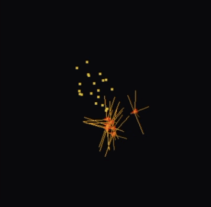

1. Making the Wild Boids evolution program with Claude Code.
2. This LLM stage is a big deal. Reasons why people think it isn't are instructive.
3. Why that means we should be wresting tech from the clutches of the f---heads.

Back in 2008 at the start of the PhD, I had a Java assignment over the Spring break. I had a go at coding a little artificial life simulation, bouncing off Craig Reynolds' classic [boids](https://processing.org/examples/flocking.html). Reynolds hard-coded rules that let flocking emerge from individual interactions. I'd been mulling (as had others) how flocks could possibly have evolved. Could a genetic simulation find out?

That assignment got some of the way - it never saw flocking emerge, but through digital evolution, boids reacting entirely randomly to each other slowly morphed into what looked a lot like actual intention. They began to chase, to evade.

That appearance of disturbingly life-like behaviour emerging from nothing burrowed its way into my psyche. It made me wonder if my own intentions were illusions. Was I just a chemical bag of noise with added iteration? (It ended up in [the sci-fi book](https://coveredinbees.org/posts/i_wrote_a_scifi_book/) of course. [Here's](https://exobrain.coveredinbees.org/oldscript/oldscript-scenes/john-predator-prey/) the scene.)  

That tiny window into life the Java code found was something I always wanted to return to, but never had the time. Everyone has those - projects that lurk in the back rooms of the brain, surfacing occasionally. "Wouldn't it be good to see that through..."

Jump to twenty years later (argh). This winter and spring, I and many other devs/coders had our first proper "oh shit" moment with LLMs. I saw [Jon Minton](https://www.linkedin.com/in/jon-minton-09480b13a/) saying it first: it's getting serious now. So I tried Claude Code (hereafter CC) with increasingly complex ideas, until my mind turned back to those disturbing boids...

So in random bits of time over February and March, working in a folder on my machine alongside CC, the [Wild Boids](https://github.com/DanOlner/WildBoids) prototype was made. [Here's a 2.5 minute video](https://www.youtube.com/watch?v=x2IJEtVqr4E) showing its evolutionary stages right through to the first time flocking evolved (predators circling food, having learned to wait for prey there together).

Before we talk through the insanity, joy and horror of all this, here's the Wild Boid essentials:

- **Modular C++ simulation**: physics engine, separate from evolution engine, separate from GUI, separate from boid brains. Boid brains have a JSON spec for loading/saving - see the initial simple prey boid [here](https://github.com/DanOlner/WildBoids/blob/0b042801b787f36967861ad46ebfb6f791d27a8d/data/simple_boid.json), a 76th generation example [here](https://github.com/DanOlner/WildBoids/blob/master/data/champion_packages/2026-03-04/champion_predator_gen76.json) and that tournament's top prey and predator breakdown [here](https://danolner.github.io/WildBoids/champion_comparisons/champion_comparison_2026-03-04.html) (scroll down for force-map of each boid's brain, note how different they are). The [github front page](https://github.com/DanOlner/WildBoids) README runs through setup and use.
- **Boids use realistic thrusters**. They evolve weights that feed sensor input through to thruster output. The 'realistic physics' choice was driven by the 2007 attempt: back then, they evolved to take advantage of poorly specified physics (Reynolds' original was never aiming for physical realism) by learning to 'skip' when chasing. Boids forced into realism have no such reality hacks.
- **[NEAT evolution](https://en.wikipedia.org/wiki/Neuroevolution_of_augmenting_topologies) algorithm run as tournaments.** Start with pure in/out weights and test adding neurons between inputs and outputs - if they confer advantage, keep. Otherwise drop. You'll see in [the video](https://www.youtube.com/watch?v=x2IJEtVqr4E) some boids quite effectively forage with no neurons between in/out at all - selection can find good direct I/O weights. But additional nodes can allow effective combinations of input signal, both reinforcing and dampening, so they can react more conditionally. This becomes vital when balancing food, predators, flocking, hunger.

## This is a big deal

This was my first project with CC that felt large - not in raw bytes, but in the combination of theory, architecture and execution. At no point did it fall down in any major way. Through dialogue and documentation (see the [planning docs](https://github.com/DanOlner/WildBoids/tree/0b042801b787f36967861ad46ebfb6f791d27a8d/planningdocs)) it was built in a modular, iterative way, working out what scale of chunk to take on, what level of architectural thinking worked, when to back off and try other paths. 

I didn't write a single line of C++ code. I asked CC to run through my [2007 Java code](https://github.com/DanOlner/WildBoids/tree/0b042801b787f36967861ad46ebfb6f791d27a8d/orig_java/boids) and pull out ideas from it - that's the only place human fingers were involved in the programming. I've [written some C++ before](https://github.com/DanOlner/socialfrontier_sim) as R plugins for speedy hill-climbing of spatial measures and boundary classification, but none of that is very structural, and not radically different from the same in Java or other languages. It's a bit like knowing how a steering wheel works compared to understanding how to engineer the whole car. For Wild Boids, CC took care of the C++ equivalent of building the car, for the most part. I thought in [OOP](https://en.wikipedia.org/wiki/Object-oriented_programming) terms, which will have helped. But it's not straightforward to separate what was me, what was CC.

This is a big deal. Before this jump in ability at the start of 2026, LLMs were impressive but flawed, hit and miss. There's been a sudden, radical lowering of the barriers between project ideas, aims, hopes, and those projects actually existing. The speed difference changes the nature of what can be built, not just the quantity, because of how smooth the cycle of testing, learning and Jacobs-like "accident fuelled by intention" now is.

There have been plenty of other tech big deals and they're easy to forget once they become the water we swim in. Internet, google search, mobile phones - just as radical breaks in how human knowledge functions (though all being quickly changed by LLMs). 

But this break in how coding happens feels very new. The tech is only months old. What happens next?

## Is this a big deal though?

LinkedIn posts are now about 95% this and other LLM questions. Everyone is thus [very tired of hearing about AI](https://theoatmeal.com/comics/ai_art). There are not many opinions that manage to thread a needle through the no-man's land of fixed positions for or against. If we want to stand a chance of understanding the effect of LLMs, it's useful to dig into why it's become so divisive. 

Those of us jumping up and down shouting "big deal!" fall in a gap. On one side, when I've tried to show non-devs this tech, it turns out without the coding background, people go "Oh that's nice / impressive / I don't quite get it". That may well rapidly change as the tools improve, but the potential impact just isn't widely known right now. We hear much flapping from government about how AI is going to solve male pattern balding or whatever, but no-one, least of all government, seems able to say how.

On the other side, there are committed anti-LLMers who say things like:

> "LLMs impress the writers who do not want to write, the coders who don’t want to code, the researchers who don’t want to research, and the lawyers that don’t want to actually understand case law." ([Ed Zitron](https://www.wheresyoured.at/the-revenge-of-the-business-idiot/) via [here](https://bsky.app/profile/sethpartnow.bsky.social/post/3mmrkphr6ik2l).)

This often seems to start from moral opposition to the tech and work backwards to "people who think it's a big deal must be idiots or Sam Altman."

But that means *also* missing what's happening through sheer refusal to look at it. I am a coder, I've been doing it since I had a ZX81 aged eight. I am not an easily impressed 'coder who doesn't want to code'. I'm experienced enough to know what a rupture it is when Claude Code can do something like Wild Boids.

I am not for a second trying to suggest technology is [beyond ethical consideration](https://www.sambrinson.com/is-technology-neutral/) - quite the reverse. But the LLM polarisation we've got ourselves into makes it more difficult to speak clearly about what's going on and what we want to happen next.

This touches older stories about technology like nuclear power and GM crops. [I took a](https://coveredinbees.org.archived.website/node/387.html) "pro-GM if it's publicly funded" position some years back; opposition to GM shares a lot of the DNA of anti-LLM arguments. As with nuclear power, LLMs are absolute classic Feynman (excuse the 'man'):

> “To every man is given the key to the gates of heaven. The same key opens the gates of hell. And so it is with science.”

LLMs in their current form have no lack of hellish features. Their energy use is prising open the gates of climate hell a few more inches. Those in charge of the most advanced models are broadly the worst people imaginable - Eleanor Morton hardly has to to embellish [here](https://www.youtube.com/watch?v=ZseOJeYmitE) to parody how bond-villain they are. (Shockingly, this is transpiring to be true of pretty much everyone who wishes to be a billionaire. Who knew?) Copyright lawyers who'd [throw people in jail for downloading an MP3](https://bsky.app/profile/lordravenscraft.bsky.social/post/3mltskxhp6227) seem to have developed amnesia now these firms are [happily stealing](https://www.theatlantic.com/technology/archive/2025/03/search-libgen-data-set/682094/) all human knowledge and [killing the open, global ways we shared learning](https://www.reddit.com/r/computerscience/comments/1pggxcr/llms_really_killed_stackoverflow/).

And all of that does shape *how* the tech disrupts - you can't cleanly separate its impacts from its origins. Uber and open-source driver tool [Namma Yatri](https://github.com/nammayatri/nammayatri) aim to do roughly the same thing; their effect on taxi drivers couldn't be more opposed.

This may all come down to a simple question: can we wrest control of technology from the f---heads? For GM, can we make sure more money goes to public research, not Monsanto? Go ahead and boycott if you like but, pragmatically, don't expect to have much effect. The impact of atomised individual choices was [sold to us by oil firms](https://theconversation.com/the-carbon-footprint-was-co-opted-by-fossil-fuel-companies-to-shift-climate-blame-heres-how-it-can-serve-us-again-183566) "to shift the burden of blame from companies to consumers". 

*Collective* action, though - that's a different beast. Personally choosing to fly or not - same problem. But imagine if we had a well-structured national debate on flying, we might collectively agree to cut it right back and move to alternatives.

So let's happily and righteously nationalise twitter / X or put it into public trust and run it on [algorithms that serve us](https://tomstafford.substack.com/p/another-algorithm-is-possible), not polarise and exploit us. Use democratic tools so we collectively agree a direction out of climate hell. Build a platform constitution so Uber-type firms are no longer untouchable parasitic sky-gods leaving millions trapped in poverty grunt work.

And constrain LLMs so their growth sits within our social and climate goals. We can do that. It's our f---ing planet.

I'm aware how utopian that all sounds. But for me it's more realistic than pretending it'll all go just go away if we signal how morally opposed we are. It's going to take more work - but that actually means we can - maybe, maybe - end up in a better place, where tech works for us.

## Where is it going?

This version of Claude Code is a baby. My brain is part of what's being fed to the baby. The LLM firms are feeding my learning above back in as I use it - parallels to Uber learning from drivers so they can build their driverless car future and dump the meatsacks.

Here's [one take](https://www.thealgorithmicbridge.com/p/kayfable) on that future:

> They won’t need us - consumers and enterprises alike - even for appearances. Our data is theirs. Our money, inconsequential. As soon as that happens - and I contend that it will happen soonish - Anthropic will immediately cut off its technology from the world. It won’t be available even in closed form. “It’s not a toy,” they will say, “and you’re just a bunch of kids.”

That feels plausible. The kind of power CC gives me right now feels like a golden moment that won't last, not least because I'm only paying about a tenth of its actual cost. It also does feel slightly dangerous, how easy it is to make complex tools. Maybe they learn what they can from idiots like me giving them free brain uploads and then they dump us meatsacks. Programming then becomes a single Sauron-like eye every firm pays the machine god top dollar for (but just cheap enough to undercut the meatsack brains they uploaded).

But then... this isn't a purely first-mover-gains-all tech like google search. Others are working on it. It's changing fast. What else will arrive, from which unlikely sources? What different shapes will those tools take, if the big players decide to pull up the drawbridge or [go pop](https://polymarket.com/event/ai-bubble-burst-by)?

Technological change is fundamentally, intrinsically unpredictable. It percolates through the complexity of human lives and economies, those forces push back, it cycles. What it *doesn't* do is disappear because we don't like it. We deal with that built-in uncertainty by taking collective action to look after ourselves as impacts become apparent, and do what we can to prise technology out of the hands of the f---heads.

A future where anyone can have an idea and then, through natural language, see that idea realised, could be pretty cool. But let's collectively try and get there with as little f---headery as possible. 

Oh, and apologies in advance if a later Claude-Code-written evolved drone swarm built on Wild Boids kills your entire town.